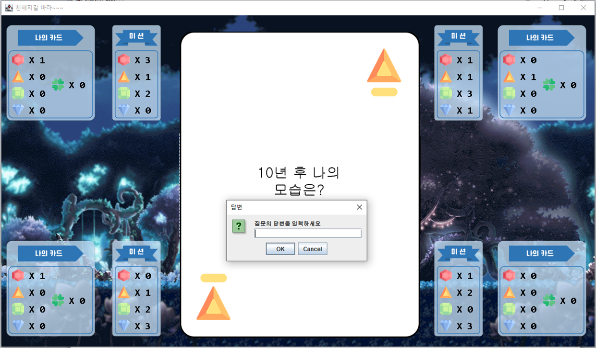

# 젬톡(GemTalk)

## Intro
각 플레이어에게 주어지는 미션카드에 맞는 보석 개수를 가장 빨리 모으는 플레이어가 승리하는 카드 게임입니다.  

## 목적
비대면으로 수업을 수강하다 대면으로 전환했을 때, 서로 많이 어색합니다.  
이러한 어색함을 카드 게임을 하면서 해소할 수 있도록 하였습니다.  

## 진행기간
2020.10.16 ~ 2020.10.20 기획  
2020.10.21 ~ 2020.10.30 개발

## 게임 일부 장면

## 만든이
- [x] [이수철](https://github.com/suchel653)
- [x] [김건영](https://github.com/aengun)
- [x] [김승현](https://github.com/Seugnhyun)
- [x] [조재희](https://github.com/cbw1030)

## Tech
- [x] Java JDK 14
- [x] AWT(Abstract Window Toolkit)
